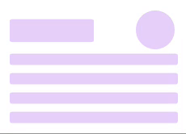

# Theme-UI Skeleton



This package contains a small component to help build skeleton loading.

## Quickstart

```shell
▶ yarn add theme-ui-skeleton
```

## Contribute

Please open issues if you have questions or issues. I'm trying to keep this
package as small as possible, so before adding any components, please open an
issue we can discuss.
